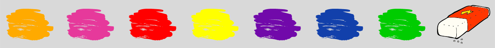
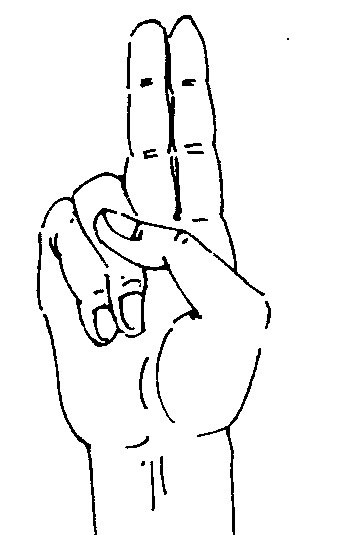
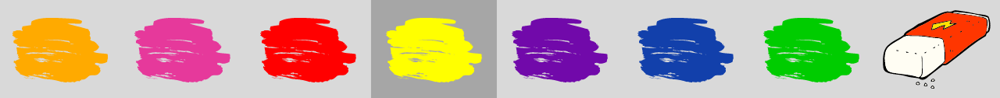

### Virtual Painter

This is an application for virtual paint using your web-camera (currently only 1280x720 is supported).

In the top of image from your webcam you see a header with 7 different colours and eraser at top right corner.

To pick a colour pick up your forefinger and middle finger together and point them at chosen colour as below.

This colour will highlight a bit as below.

Then use your forefinger to draw. 

So when you put forefinger and middle finger together - this is a selection mode, you can't draw.

